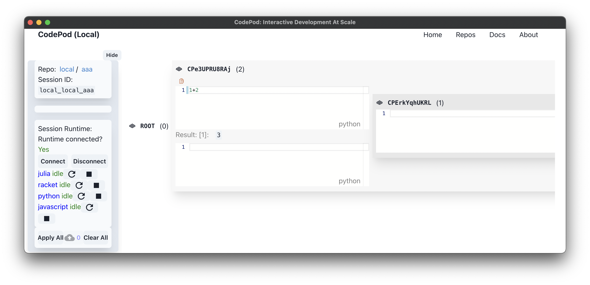

# CodePod: A Hierarchical IDE for Interactive Development at Scale



# Installation

Binary release available for Linux and MacOS. See release page.

For Debian/Ubuntu:

```
sudo dpkg -i codepod_0.1.0_amd64.deb
```

On Mac, use the `codepod_0.1.0_arm64.dmg` image (for M1 Macs with Apple Sillicon).

You can run `codepod` either in application launcher or through the `codepod` command line tool.

# Install Jupyter kernels

These kernels are Jupyter kernels. CodePod should detect them and work as long
as they are properly installed to work in Jupyter.

## python

```
sudo apt install python3
```

Install ipykernel:

```
python3 -m pip install ipykernel
python3 -m ipykernel install --user
```

## racket

Install on Ubuntu:

```
sudo add-apt-repository ppa:plt/racket
sudo apt-get update
sudo apt install racket
```

Install zmq:

```
brew install zmq
sudo apt install libzmq5
```

```
raco pkg install --auto iracket
raco iracket install
```

On mac, zeromq lib cannot be found by racket due to [a known
issue](https://github.com/rmculpepper/racket-zeromq/issues/6). To side-step it
(replace the version numbers with your installation):

```
cp /opt/homebrew/Cellar/zeromq/4.3.4/lib/libzmq.5.dylib ~/Library/Racket/8.2/lib
```

## julia

Install julia from the official binaries. On Ubuntu:

```
curl -O https://julialang-s3.julialang.org/bin/linux/x64/1.6/julia-1.6.4-linux-x86_64.tar.gz
tar -xvzf julia-1.6.4-linux-x86_64.tar.gz
sudo mv julia-1.6.4/ /opt/
sudo ln -s /opt/julia-1.6.4/bin/julia /usr/local/bin/julia
```

<!--
```
julia
]add add IJulia
import IJulia
IJulia.installkernel("Julia nodeps", "--depwarn=no")
```

Or just -->

Install kernel:

```
julia -e 'import Pkg; Pkg.add("IJulia"); using IJulia; installkernel("Julia nodeps", "--depwarn=no")'
```

## Javascript

```
npm install -g ijavascript
ijsinstall
```

# Development Scripts

Develop

```
cd app
npm run dev
```

Build:

```
cd app
npm run build:all
```
